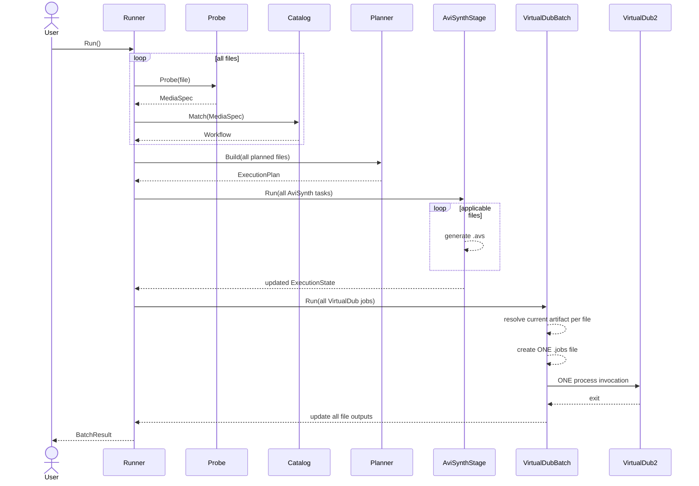
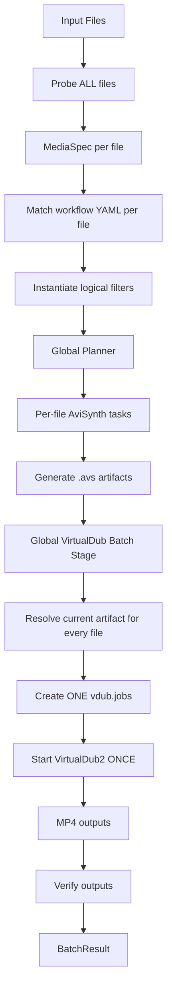

# MediaLang – Zielarchitektur für deklarative Filter-Workflows mit gebatchter VirtualDub2-Ausführung

**Ziel:** Implementierung einer neuen MediaLang-Architektur, in der Filter per YAML konfiguriert, zu Workflows verkettet und erst mit `Run()` ausgeführt werden.  
**Besonderheit:** VirtualDub2 wird **nicht pro Datei** gestartet. Der Planner sammelt alle für VirtualDub2 vorgesehenen Jobs aller Eingabedateien in **eine gemeinsame `.jobs`-Datei** und startet VirtualDub2 **genau einmal pro Run**.

Dieses Dokument ist als technische Implementierungsspezifikation für Codex gedacht.

---

# 1. Architekturziele

Die neue Architektur soll folgende Eigenschaften besitzen:

1. Filter werden deklarativ in YAML konfiguriert.
2. Mehrere Filter bilden einen Workflow.
3. Der Output eines logischen Filters ist der Input des nächsten Filters.
4. Die Auswahl des Workflows erfolgt automatisch anhand des erkannten Source-Materials.
5. Die Erkennung des Source-Materials erfolgt über `ffprobe`.
6. Die Iteration über Eingabedateien liegt außerhalb der Workflow-Definition.
7. Erst ein expliziter Aufruf von `Run()` startet die Verarbeitung.
8. Filter desselben Processing-Backends sollen zu möglichst wenigen realen Ausführungsschritten zusammengefasst werden.
9. Insbesondere werden alle VirtualDub2-Jobs eines Runs gesammelt und gemeinsam ausgeführt.
10. CLI und eine zukünftige GUI verwenden dieselbe Backend-API.
11. Die GUI soll keine AviSynth- oder VirtualDub-Skripte direkt erzeugen müssen.
12. Die Architektur soll später weitere Engines wie FFmpeg unterstützen können.

---

# 2. Grundprinzip

Die logische Verarbeitung eines einzelnen Videos bleibt:

```text
Input
  ↓
Filter A
  ↓
Filter B
  ↓
Filter C
  ↓
Output
```

Die physische Ausführung darf davon abweichen.

Beispiel:

```text
Logical workflow

QTGMC
  ↓
Resize
  ↓
Sharpen
  ↓
Dehalo
  ↓
Deshaker
  ↓
Encode
```

wird vom Planner kompiliert zu:

```text
Execution Plan

AviSynth Stage
    QTGMC
    Resize
    Sharpen
    Dehalo

        ↓

VirtualDub Batch Stage
    Deshaker
    Encode
```

Für mehrere Eingabedateien:

```text
file01 ─┐
file02 ─┼─> AviSynth preparation per file ─┐
file03 ─┤                                  │
file04 ─┘                                  │
                                          ▼
                              ONE VirtualDub .jobs file
                                          │
                                          ▼
                              ONE VirtualDub2 process
                                          │
                                          ▼
                              all resulting MP4 files
```

---

# 3. Wichtige Abgrenzung

Ein **Filter** beschreibt, *was* mit einem Medium passieren soll.

Eine **ExecutionStage** beschreibt, *wie* und *wann* diese Verarbeitung tatsächlich ausgeführt wird.

Diese Trennung ist zentral.

```text
Filter
    ↓
Planner
    ↓
ExecutionStage
    ↓
Engine
```

Dadurch kann beispielsweise:

```text
QTGMC
Resize
Sharpen
FineDehalo
```

als vier logische Filter modelliert werden, obwohl technisch nur ein AviSynth-Script erzeugt wird.

Genauso können:

```text
Deshaker
Encode
```

als logische Filter erscheinen, während technisch alle Dateien in einer einzigen VirtualDub2-Jobdatei verarbeitet werden.

---

# 4. Empfohlene Package-Struktur

```text
medialang/
│
├── media/
│   ├── artifact.go
│   ├── spec.go
│   ├── source_type.go
│   └── result.go
│
├── probe/
│   ├── probe.go
│   └── ffprobe.go
│
├── workflow/
│   ├── definition.go
│   ├── loader.go
│   ├── catalog.go
│   ├── matcher.go
│   ├── workflow.go
│   ├── planner.go
│   ├── execution_plan.go
│   └── runner.go
│
├── filter/
│   ├── filter.go
│   ├── registry.go
│   │
│   ├── avisynth/
│   │   ├── qtgmc.go
│   │   ├── resize.go
│   │   ├── crop.go
│   │   ├── sharpen.go
│   │   ├── denoise.go
│   │   ├── dehalo.go
│   │   └── tweak.go
│   │
│   └── virtualdub/
│       ├── deshaker.go
│       └── encode.go
│
├── engine/
│   ├── engine.go
│   │
│   ├── avisynth/
│   │   ├── compiler.go
│   │   └── stage.go
│   │
│   └── virtualdub/
│       ├── compiler.go
│       ├── jobs.go
│       ├── stage.go
│       └── runner.go
│
├── config/
│   ├── app.go
│   └── tools.go
│
└── cmd/
    └── medialang/
        └── main.go
```

---

# 5. Kern-Datenmodelle

## 5.1 MediaSpec

`MediaSpec` enthält normalisierte technische Eigenschaften eines Mediums.

```go
package media

type ScanType string

const (
    ScanProgressive ScanType = "progressive"
    ScanInterlaced  ScanType = "interlaced"
    ScanUnknown     ScanType = "unknown"
)

type FieldOrder string

const (
    FieldOrderTFF     FieldOrder = "tff"
    FieldOrderBFF     FieldOrder = "bff"
    FieldOrderUnknown FieldOrder = "unknown"
)

type MediaSpec struct {
    Container string
    Codec     string

    Width  int
    Height int

    FPS float64

    ScanType   ScanType
    FieldOrder FieldOrder

    PixelFormat string

    SampleAspectRatio  string
    DisplayAspectRatio string

    AudioCodec string
}
```

---

# 6. Artifact

Nicht nur Dateipfade weiterreichen.

```go
package media

type ArtifactType string

const (
    ArtifactSource   ArtifactType = "source"
    ArtifactAviSynth ArtifactType = "avisynth"
    ArtifactVideo    ArtifactType = "video"
    ArtifactTemp     ArtifactType = "temp"
)

type Artifact struct {
    Path string
    Type ArtifactType

    Media MediaSpec
}
```

Ein logischer Workflow arbeitet damit konzeptionell weiterhin:

```text
Artifact → Artifact
```

---

# 7. Source Detection

Source Detection besteht aus zwei getrennten Schritten.

```text
ffprobe
   ↓
MediaSpec
   ↓
Workflow Matcher
   ↓
WorkflowDefinition
```

`ffprobe` liefert nur Fakten.

Es entscheidet nicht selbst, ob ein Video beispielsweise:

```text
HDV 25i
DV
FullHD 25p
4K 50p
```

ist.

---

# 8. Probe Interface

```go
package probe

type Probe interface {
    Probe(
        ctx context.Context,
        filename string,
    ) (media.MediaSpec, error)
}
```

Erste Implementierung:

```go
type FFProbe struct {
    Executable string
}
```

---

# 9. Workflow Definition

Eine Workflow-Datei enthält:

1. Identität
2. Match-Regeln
3. Priorität
4. logische Filterkette

Beispiel:

```yaml
version: 1

id: hdv-25i
name: HDV 1080i25 Restoration

priority: 100

match:
  container:
    - mpegts

  codec:
    - mpeg2video

  width: 1440
  height: 1080

  fps:
    min: 24.9
    max: 25.1

  scan:
    - interlaced

workflow:

  - id: deinterlace
    filter: avisynth.qtgmc
    config:
      preset: Slower

  - id: resize
    filter: avisynth.resize
    config:
      width: 1920
      height: 1080
      algorithm: spline64

  - id: sharpen
    filter: avisynth.lsfmod
    enabled: true
    config:
      mode: slow
      strength: 100

  - id: stabilize
    filter: virtualdub.deshaker
    enabled: true
    config:
      reuse_analysis: true

  - id: encode
    filter: virtualdub.encode
    config:
      container: mp4
      video_codec: h264
      audio_codec: aac
```

---

# 10. WorkflowDefinition in Go

```go
type WorkflowDefinition struct {
    Version  int    `yaml:"version"`
    ID       string `yaml:"id"`
    Name     string `yaml:"name"`
    Priority int    `yaml:"priority"`

    Match MatchDefinition `yaml:"match"`

    Workflow []FilterNodeDefinition `yaml:"workflow"`
}
```

Filterknoten:

```go
type FilterNodeDefinition struct {
    ID      string    `yaml:"id"`
    Filter  string    `yaml:"filter"`
    Enabled *bool     `yaml:"enabled,omitempty"`
    Config  yaml.Node `yaml:"config,omitempty"`
}
```

---

# 11. Filter Registry

Die YAML-Konfiguration kennt keine Go-Typen.

```yaml
filter: avisynth.qtgmc
```

Die Zuordnung erfolgt über eine Registry.

```go
type FilterFactory interface {
    Type() string

    Create(
        config yaml.Node,
    ) (Filter, error)
}
```

Registry:

```go
registry.Register(
    "avisynth.qtgmc",
    qtgmc.Factory{},
)

registry.Register(
    "avisynth.resize",
    resize.Factory{},
)

registry.Register(
    "virtualdub.deshaker",
    deshaker.Factory{},
)
```

---

# 12. Filter Interface

Ein Filter sollte zunächst deklarativ sein.

```go
type Filter interface {
    ID() string

    Engine() engine.Type

    Validate(
        input media.MediaSpec,
    ) (media.MediaSpec, error)
}
```

Der Filter muss nicht zwingend selbst einen externen Prozess starten.

Das ist Aufgabe der Engine bzw. der `ExecutionStage`.

---

# 13. Engine Type

```go
package engine

type Type string

const (
    AviSynth   Type = "avisynth"
    VirtualDub Type = "virtualdub"
    FFmpeg     Type = "ffmpeg"
)
```

---

# 14. Typisierte Filterkonfiguration

Beispiel QTGMC:

```go
type Config struct {
    Preset string `yaml:"preset"`
}
```

Resize:

```go
type Config struct {
    Width     int    `yaml:"width"`
    Height    int    `yaml:"height"`
    Algorithm string `yaml:"algorithm"`
}
```

Deshaker:

```go
type Config struct {
    ReuseAnalysis bool `yaml:"reuse_analysis"`
}
```

Encode:

```go
type Config struct {
    Container  string `yaml:"container"`
    VideoCodec string `yaml:"video_codec"`
    AudioCodec string `yaml:"audio_codec"`
}
```

---

# 15. Workflow Catalog

Alle YAML-Workflows werden beim Start geladen.

```go
type Catalog struct {
    workflows []*WorkflowDefinition
}
```

API:

```go
func LoadCatalog(
    directory string,
) (*Catalog, error)
```

Workflow-Auswahl:

```go
func (c *Catalog) Match(
    spec media.MediaSpec,
) (*WorkflowDefinition, error)
```

---

# 16. Matching

Ein Match sollte nicht nur `true/false` liefern.

```go
type MatchResult struct {
    Matches bool
    Score   int

    Reasons []string
}
```

Dann kann die Auswahl beispielsweise lauten:

```text
HDV 25i        score 100
Generic MPEG2  score  60
Generic Video  score  10
```

Bei mehreren Treffern entscheidet:

1. `Matches == true`
2. höchste `priority`
3. danach höchster `Score`

Bei Gleichstand soll ein eindeutiger Fehler erzeugt werden.

---

# 17. Runner API

Die öffentliche API sollte einfach bleiben.

```go
runner := medialang.NewRunner(
    medialang.WithWorkflowCatalog("./config/workflows"),
    medialang.WithFiles(files),
)

result, err := runner.Run(ctx)
```

oder:

```go
runner := medialang.NewRunner(config)

runner.Add("video01.m2t")
runner.Add("video02.m2t")
runner.Add("video03.avi")

result, err := runner.Run(ctx)
```

Bis `Run()` aufgerufen wird, darf **keine Medienverarbeitung** stattfinden.

---

# 18. Die entscheidende Änderung: Planning vor Execution

Der Runner darf nicht mehr einfach:

```text
for each file
    execute complete workflow
```

machen.

Das würde dazu führen, dass VirtualDub2 für jede Datei einzeln gestartet wird.

Stattdessen müssen zunächst **alle Dateien analysiert und geplant** werden.

Neue Top-Level-Logik:

```text
Run()
  │
  ├── Phase 1: Identify ALL sources
  │
  ├── Phase 2: Resolve workflow for EACH source
  │
  ├── Phase 3: Build ONE global ExecutionPlan
  │
  └── Phase 4: Execute ExecutionPlan
```

---

# 19. Neue Run()-Semantik

```go
func (r *Runner) Run(
    ctx context.Context,
) (*BatchResult, error) {

    inputs, err := r.identifyAll(ctx)
    if err != nil {
        return nil, err
    }

    plannedFiles, err := r.resolveWorkflows(inputs)
    if err != nil {
        return nil, err
    }

    plan, err := r.planner.Build(plannedFiles)
    if err != nil {
        return nil, err
    }

    return r.executor.Run(ctx, plan)
}
```

---

# 20. PlannedFile

```go
type PlannedFile struct {
    Input media.Artifact

    SourceSpec media.MediaSpec

    Workflow *WorkflowDefinition

    Filters []filter.Filter
}
```

Zu diesem Zeitpunkt ist noch keine eigentliche Verarbeitung erfolgt.

---

# 21. ExecutionPlan

Der Planner baut aus **allen Eingabedateien zusammen** einen globalen Plan.

```go
type ExecutionPlan struct {
    Stages []ExecutionStage
}
```

Interface:

```go
type ExecutionStage interface {
    ID() string

    Run(
        ctx context.Context,
        state *ExecutionState,
    ) error
}
```

---

# 22. ExecutionState

Der `ExecutionState` hält für jede Eingabedatei das aktuell gültige Artifact.

```go
type FileState struct {
    Input media.Artifact

    Current media.Artifact

    WorkflowID string

    Error error
}

type ExecutionState struct {
    Files []*FileState

    Context *ExecutionContext
}
```

Damit kann eine Stage mehrere Dateien gleichzeitig bearbeiten.

---

# 23. Per-File Stage

AviSynth-Vorbereitung ist beispielsweise pro Datei.

```go
type PerFileStage struct {
    id string

    tasks []PerFileTask
}
```

Konzeptionell:

```go
for each task {
    current := state.Files[task.FileIndex].Current

    output, err := task.Run(ctx, current)

    state.Files[task.FileIndex].Current = output
}
```

---

# 24. Batch Stage

VirtualDub2 wird als **BatchExecutionStage** implementiert.

```go
type BatchExecutionStage interface {
    ExecutionStage

    RunBatch(
        ctx context.Context,
        state *ExecutionState,
    ) error
}
```

Konkret:

```go
type VirtualDubBatchStage struct {
    Jobs []VirtualDubJob
}
```

---

# 25. Planner-Grundidee

Der Planner verarbeitet nicht eine Datei, sondern:

```go
Build(files []PlannedFile)
```

Signatur:

```go
type Planner interface {
    Build(
        files []PlannedFile,
    ) (*ExecutionPlan, error)
}
```

---

# 26. Planner-Algorithmus

## Schritt 1

Für jede Datei:

```text
Workflow laden
↓
Filter instanziieren
↓
Filter validieren
↓
nach Engine segmentieren
```

Beispiel Datei 1:

```text
AviSynth:
    QTGMC
    Resize
    Sharpen

VirtualDub:
    Deshaker
    Encode
```

Datei 2:

```text
AviSynth:
    ConvertToYV12
    Denoise
    Resize

VirtualDub:
    Deshaker
    Encode
```

---

# 27. Planner bildet logische Engine-Segmente

Interne Darstellung:

```go
type EngineSegment struct {
    FileIndex int

    Engine engine.Type

    Filters []filter.Filter
}
```

Beispiel:

```text
File 0 / Segment 0 / AviSynth
File 0 / Segment 1 / VirtualDub

File 1 / Segment 0 / AviSynth
File 1 / Segment 1 / VirtualDub

File 2 / Segment 0 / AviSynth
File 2 / Segment 1 / VirtualDub
```

---

# 28. VirtualDub-Regel für Version 1

Für die erste Implementierung gelten folgende Constraints:

1. Pro Workflow darf es maximal **ein zusammenhängendes VirtualDub-Segment** geben.
2. Alle VirtualDub-Filter eines Workflows müssen unmittelbar aufeinander folgen.
3. Das VirtualDub-Segment soll normalerweise der letzte Engine-Block des Workflows sein.
4. Alle Dateien eines Runs werden zu **einer gemeinsamen VirtualDubBatchStage** zusammengeführt.
5. VirtualDub2 wird pro `Runner.Run()` maximal einmal gestartet.

Validierungsfehler:

```text
workflow contains multiple separated VirtualDub segments
```

oder:

```text
VirtualDub segment is followed by an unsupported engine stage
```

Falls später Post-Processing nach VirtualDub benötigt wird, kann die Engine-Planung erweitert werden.

---

# 29. Warum diese Einschränkung sinnvoll ist

Damit bleibt Version 1 einfach:

```text
per-file preparation
      ↓
GLOBAL VirtualDub barrier
      ↓
done
```

und der wichtigste technische Vorteil bleibt erhalten:

> VirtualDub2 wird nur einmal gestartet.

Die vorhandene MediaLang-Pipeline entspricht bereits diesem Muster.

---

# 30. Globaler Plan

Bei drei Dateien kann der Plan beispielsweise sein:

```text
Stage 1:
    PerFileAviSynthStage

    file01 -> file01.avs
    file02 -> file02.avs
    file03 -> file03.avs

Stage 2:
    VirtualDubBatchStage

    file01.avs
    file02.avs
    file03.avs

    ↓

    one vdub.jobs
    one VirtualDub64.exe /s vdub.jobs

    ↓

    file01.mp4
    file02.mp4
    file03.mp4
```

---

# 31. Planner-Pseudocode

```go
func (p *Planner) Build(
    files []PlannedFile,
) (*ExecutionPlan, error) {

    plan := &ExecutionPlan{}

    var aviTasks []AviSynthTask
    var vdubJobs []VirtualDubJob

    for i, file := range files {

        segments, err := p.segment(file.Filters)
        if err != nil {
            return nil, err
        }

        if err := validateSegments(segments); err != nil {
            return nil, err
        }

        for _, segment := range segments {

            switch segment.Engine {

            case engine.AviSynth:

                task, err :=
                    p.avisynthCompiler.Compile(
                        i,
                        file,
                        segment,
                    )

                if err != nil {
                    return nil, err
                }

                aviTasks = append(
                    aviTasks,
                    task,
                )

            case engine.VirtualDub:

                job, err :=
                    p.virtualDubCompiler.Compile(
                        i,
                        file,
                        segment,
                    )

                if err != nil {
                    return nil, err
                }

                vdubJobs = append(
                    vdubJobs,
                    job,
                )
            }
        }
    }

    if len(aviTasks) > 0 {
        plan.Stages = append(
            plan.Stages,
            NewAviSynthStage(aviTasks),
        )
    }

    if len(vdubJobs) > 0 {
        plan.Stages = append(
            plan.Stages,
            NewVirtualDubBatchStage(vdubJobs),
        )
    }

    return plan, nil
}
```

---

# 32. Wichtig: VirtualDub Input erst zur Laufzeit auflösen

Beim Planning kennt eine Datei möglicherweise nur:

```text
source = file01.m2t
```

Der VirtualDub-Input soll aber später:

```text
file01.avs
```

sein.

Deshalb sollte `VirtualDubJob` nicht nur einen festen Inputpfad enthalten, sondern auf einen `FileState` referenzieren.

Beispiel:

```go
type VirtualDubJob struct {
    FileIndex int

    Filters []filter.Filter

    OutputPath string

    DeshakeLogPath string
}
```

Beim Start der BatchStage:

```go
input :=
    state.Files[job.FileIndex].Current.Path
```

Damit erhält VirtualDub automatisch den Output der vorherigen Stage.

---

# 33. VirtualDubJob

Empfohlenes Modell:

```go
type VirtualDubJob struct {
    FileIndex int

    OutputPath string

    DeshakeLogPath string

    ReuseAnalysis bool

    Deshaker *DeshakerConfig
    Encode   *EncodeConfig
}
```

Optional:

```go
type VirtualDubJob struct {
    ID string

    FileIndex int

    InputResolver ArtifactResolver

    OutputPath string

    Passes []VirtualDubPass
}
```

Für Version 1 reicht jedoch `FileIndex`.

---

# 34. VirtualDubBatchStage

```go
type VirtualDubBatchStage struct {
    Jobs []VirtualDubJob

    Runner *virtualdub.Runner
}
```

`Run()`:

```go
func (s *VirtualDubBatchStage) Run(
    ctx context.Context,
    state *ExecutionState,
) error {

    resolvedJobs, err :=
        s.resolveJobs(state)

    if err != nil {
        return err
    }

    jobsFile, err :=
        s.Runner.BuildJobsFile(
            resolvedJobs,
        )

    if err != nil {
        return err
    }

    result, err :=
        s.Runner.Run(
            ctx,
            jobsFile,
        )

    if err != nil {
        return err
    }

    return s.updateState(
        state,
        resolvedJobs,
        result,
    )
}
```

---

# 35. VirtualDub Runner

Neue klare Verantwortung:

```go
package engine/virtualdub

type Runner struct {
    Executable string
    WorkingDir string
}
```

API:

```go
func (r *Runner) BuildJobsFile(
    jobs []Job,
) (string, error)
```

und:

```go
func (r *Runner) Run(
    ctx context.Context,
    jobsFile string,
) (*Result, error)
```

---

# 36. Genau ein VirtualDub-Aufruf

Die Implementierung soll ausdrücklich:

```go
exec.CommandContext(
    ctx,
    executable,
    "/s",
    jobsFile,
)
```

nur **einmal** pro `VirtualDubBatchStage.Run()` aufrufen.

Nicht zulässig:

```go
for _, job := range jobs {
    exec.Command(...)
}
```

sondern:

```text
all jobs
   ↓
one .jobs file
   ↓
one VirtualDub2 process
```

---

# 37. VirtualDub Jobs File

Die bestehende MediaLang-Logik soll konzeptionell erhalten bleiben.

Eine `.jobs`-Datei enthält für jede Datei:

```text
optional Pass 1
mandatory Pass 2
```

Aktuell:

```text
Pass 1:
    Deshaker analysis
    RunNullVideoPass()

Pass 2:
    Deshaker stabilization
    Encode
    SaveAVI()
```

---

# 38. Log-Reuse

Bestehende Logik:

```text
if <video>.log exists
    skip analysis pass
```

soll erhalten bleiben.

Zusätzlich kommt aus YAML:

```yaml
- filter: virtualdub.deshaker
  config:
    reuse_analysis: true
```

Regel:

```text
reuse_analysis == true
AND
log exists
    -> skip pass 1

otherwise
    -> create pass 1
```

---

# 39. Force-Reanalysis

Optional direkt vorsehen:

```yaml
config:
  reuse_analysis: true
  force_analysis: false
```

Priorität:

```text
force_analysis == true
    -> always run pass 1

else if reuse_analysis && log exists
    -> skip pass 1

else
    -> run pass 1
```

---

# 40. Jobzählung

Die Jobanzahl der VirtualDub-Datei darf nicht einfach:

```go
len(files)
```

sein.

Denn jede Datei kann:

```text
1 Job
oder
2 Jobs
```

erzeugen.

Beispiel:

```text
file01 log missing  -> 2 jobs
file02 log exists   -> 1 job
file03 log missing  -> 2 jobs
```

Ergebnis:

```text
$numjobs 5
```

Der Builder muss die tatsächliche Anzahl berechnen.

---

# 41. Jobnummerierung

Jobnummern sollten beim Generieren sequenziell vergeben werden.

Nicht mehr direkt:

```go
Num  = i * 2
Num2 = i*2 + 1
```

weil bei übersprungenem Pass 1 Lücken entstehen können.

Empfohlen:

```go
jobNumber := 0

for each media job {

    if analysisRequired {
        create analysis job(jobNumber)
        jobNumber++
    }

    create render job(jobNumber)
    jobNumber++
}
```

---

# 42. VirtualDub Template-Modell

Bestehende Templates können zunächst wiederverwendet werden.

Langfristig sollte die Datenstruktur sauberer sein.

```go
type JobsTemplateData struct {
    Date string

    JobCount int

    Jobs []JobTemplateData
}
```

Ein Job:

```go
type JobTemplateData struct {
    Number int

    Kind JobKind

    InputFile string
    OutputFile string
    LogFile string

    Deshaker DeshakerTemplateConfig
    Encode   EncodeTemplateConfig
}
```

---

# 43. Besser als `LogExists` im Template

Heute entscheidet das Header-Template:

```text
if not LogExists
    include first pass
```

Empfohlen:

Die Entscheidung soll vorher im Go-Code getroffen werden.

Also:

```go
passes := []VirtualDubPass{}
```

und abhängig von der Konfiguration:

```go
passes = append(
    passes,
    AnalysisPass,
)

passes = append(
    passes,
    RenderPass,
)
```

Das Template rendert anschließend nur noch fertige Jobs.

Das reduziert Logik im Template.

---

# 44. Result Mapping

Nach erfolgreichem VirtualDub-Lauf wird für jede Datei:

```go
state.Files[job.FileIndex].Current =
    media.Artifact{
        Path: job.OutputPath,
        Type: media.ArtifactVideo,
        Media: job.OutputMediaSpec,
    }
```

Damit ist wieder erfüllt:

```text
Output Stage N
=
Input Stage N+1
```

---

# 45. Batch-Fehler

VirtualDub liefert nur einen Prozess-Exit-Code.

Bei einem Fehler kann möglicherweise nicht direkt festgestellt werden, welcher Einzeljob fehlgeschlagen ist.

Version 1:

```text
VirtualDub process failure
    -> VirtualDubBatchStage fails
    -> mark all unresolved VirtualDub jobs as failed
```

Optional kann später die `.jobs`-Datei oder das VirtualDub-Log geparst werden.

---

# 46. Output-Dateien validieren

Nach erfolgreichem VirtualDub-Prozess sollte nicht blind Erfolg angenommen werden.

Für jeden Job:

```go
if !FileExists(job.OutputPath) {
    mark job failed
}
```

Optional anschließend:

```go
ffprobe(output)
```

und prüfen:

```text
video stream exists
expected container exists
```

---

# 47. Temporäre Dateien

ExecutionContext:

```go
type ExecutionContext struct {
    OutputDir string
    TempDir   string
    WorkDir   string

    Tools ToolRegistry

    Progress ProgressReporter

    Logger *slog.Logger
}
```

Empfohlene Struktur:

```text
<temp>/
    <run-id>/
        avisynth/
            file01.avs
            file02.avs

        virtualdub/
            medialang.jobs

        logs/
            file01.log
            file02.log
```

---

# 48. Run-ID

Jeder `Run()` sollte eine eindeutige ID erhalten.

```go
type RunID string
```

Beispiel:

```text
2026-09-20T220600-a13f
```

Damit können:

- temporäre Dateien
- Logs
- Jobfiles
- Debug-Ausgaben

eindeutig einem Run zugeordnet werden.

---

# 49. Progress Events

```go
type ProgressEvent struct {
    RunID string

    Stage string

    FileIndex int
    FileCount int

    File string

    Status string

    Percent float64

    Message string
}
```

Beispiele:

```text
source.identify
workflow.resolve
avisynth.generate
virtualdub.prepare
virtualdub.run
output.verify
done
```

---

# 50. VirtualDub Progress

VirtualDub läuft als ein Batch.

Daher sollte die GUI mindestens unterscheiden:

```text
VirtualDub batch started
VirtualDub batch finished
```

Wenn später VirtualDub-Ausgabe geparst werden kann:

```text
VirtualDub job 3 / 12
```

Das ist optional und nicht Bestandteil der ersten Implementierung.

---

# 51. Cancellation

Der VirtualDub-Prozess muss cancellable sein.

Deshalb:

```go
exec.CommandContext(...)
```

statt:

```go
exec.Command(...)
```

Wenn `ctx` abgebrochen wird, wird der externe Prozess beendet.

Danach:

```text
run status = cancelled
```

Keine unfertigen Outputs als erfolgreich markieren.

---

# 52. Source-Material-Erkennung pro Datei

Alle Dateien werden zunächst vollständig identifiziert.

```go
func (r *Runner) identifyAll(
    ctx context.Context,
) ([]IdentifiedInput, error)
```

```go
type IdentifiedInput struct {
    Artifact media.Artifact

    Spec media.MediaSpec
}
```

Das geschieht **vor der ersten eigentlichen Filterausführung**.

---

# 53. Workflow-Auswahl pro Datei

Danach:

```go
func (r *Runner) resolveWorkflows(
    inputs []IdentifiedInput,
) ([]PlannedFile, error)
```

Somit darf ein Verzeichnis enthalten:

```text
HDV
DV
4K
FullHD
```

und jede Datei kann ihren eigenen Workflow erhalten.

Trotzdem werden die späteren VirtualDub-Jobs gemeinsam gebatcht.

---

# 54. Beispiel mit gemischtem Material

```text
file01.m2t → HDV-25i workflow
file02.avi → DV-25i workflow
file03.mp4 → FullHD-25p workflow
```

Planning:

```text
file01
    QTGMC
    Resize
    Deshaker
    Encode

file02
    SwapFields
    QTGMC
    Crop
    Resize
    Sharpen
    Deshaker
    Encode

file03
    optional Sharpen
    Deshaker
    Encode
```

Execution:

```text
Per-file AviSynth preparation:

file01 → hdv01.avs
file02 → dv02.avs
file03 → fullhd source or generated .avs

THEN

ONE VirtualDub jobs file:

job(s) for file01
job(s) for file02
job(s) for file03

THEN

ONE VirtualDub process
```

---

# 55. Warum die äußere Dateiiteration trotzdem erhalten bleibt

Die fachliche Semantik bleibt:

```text
for each file:
    workflow(file)
```

Der Planner optimiert nur die physische Ausführung.

Man kann es so betrachten:

```text
Logical execution:
    file iteration outside workflow

Physical execution:
    planner groups compatible operations
```

Das ist vergleichbar mit einem Query Planner in einer Datenbank.

---

# 56. Planner als Compiler

Der Planner sollte deshalb eher wie ein Compiler betrachtet werden.

```text
Workflow DSL / YAML
       ↓
logical filter graph
       ↓
validation
       ↓
engine grouping
       ↓
execution plan
       ↓
runner
```

---

# 57. Planner Interfaces

```go
type Planner struct {
    registry *filter.Registry

    avisynthCompiler   *avisynth.Compiler
    virtualDubCompiler *virtualdub.Compiler
}
```

```go
func (p *Planner) Build(
    files []PlannedFile,
) (*ExecutionPlan, error)
```

---

# 58. Compiler Interfaces

Optional generisch:

```go
type Compiler interface {
    Engine() engine.Type

    Compile(
        fileIndex int,
        input PlannedFile,
        filters []filter.Filter,
    ) (PlannedTask, error)
}
```

AviSynth produziert:

```text
AviSynthTask
```

VirtualDub produziert:

```text
VirtualDubJob
```

---

# 59. AviSynth Stage

```go
type AviSynthStage struct {
    Tasks []AviSynthTask
}
```

Jede Task:

```go
type AviSynthTask struct {
    FileIndex int

    Filters []filter.Filter

    OutputPath string
}
```

`Run()` erzeugt für jede Datei ein `.avs`.

Dabei wird noch kein externer AviSynth-Prozess gestartet.

Die `.avs`-Datei selbst ist das Artifact für VirtualDub.

---

# 60. ExecutionPlan Beispiel

```go
ExecutionPlan{
    Stages: []ExecutionStage{
        &AviSynthStage{
            Tasks: []AviSynthTask{
                {FileIndex: 0},
                {FileIndex: 1},
                {FileIndex: 2},
            },
        },

        &VirtualDubBatchStage{
            Jobs: []VirtualDubJob{
                {FileIndex: 0},
                {FileIndex: 1},
                {FileIndex: 2},
            },
        },
    },
}
```

---

# 61. Workflow YAMLs

Empfohlene Struktur:

```text
config/
│
├── app.yaml
│
├── filters/
│   ├── qtgmc-quality.yaml
│   ├── deshaker-default.yaml
│   └── encode-h264.yaml
│
└── workflows/
    ├── hdv-25i.yaml
    ├── dv-25i.yaml
    ├── fullhd-25p.yaml
    ├── fullhd-50p.yaml
    ├── 4k-25p.yaml
    ├── 4k-50p.yaml
    └── 30p.yaml
```

---

# 62. Separate Filter-Presets

Beispiel:

```yaml
# filters/deshaker-default.yaml

filter: virtualdub.deshaker

config:
  reuse_analysis: true
  force_analysis: false
```

Workflow:

```yaml
workflow:

  - filter: avisynth.qtgmc
    config:
      preset: Slower

  - use: ../filters/deshaker-default.yaml

  - use: ../filters/encode-h264.yaml
```

Ein Include-System kann Version 2 sein.

Für Version 1 dürfen Filter zunächst direkt im Workflow definiert werden.

---

# 63. Maschinenabhängige Konfiguration

`app.yaml`:

```yaml
tools:

  ffprobe:
    path: C:/Program Files/ffmpeg/bin/ffprobe.exe

  virtualdub:
    path: C:/Program Files/VirtualDub2/VirtualDub64.exe

  avisynth:
    plugin_path: C:/Program Files/AviSynth/plugins64+
```

Diese Werte dürfen nicht in Workflow-YAMLs stehen.

---

# 64. Config Validation

Beim Start:

```text
load app.yaml
load all workflow YAMLs
validate YAML schema
validate filter names
validate filter configs
validate workflow engine ordering
```

Fehler sollen möglichst vor `Run()` gefunden werden.

---

# 65. Planner Validation

Vor dem Erstellen des ExecutionPlans:

```text
for every workflow:

✓ all filter IDs known
✓ all configurations valid
✓ media transitions valid
✓ maximum one VirtualDub segment
✓ VirtualDub filters contiguous
✓ VirtualDub can consume previous Artifact
✓ output path unique
```

---

# 66. Artifact-Type-Validierung

Beispiel:

```text
AviSynthStage output:
    ArtifactAviSynth

VirtualDub accepts:
    ArtifactAviSynth
    ArtifactVideo
```

Damit lassen sich ungültige Verbindungen früh erkennen.

---

# 67. Output Naming

Output Naming sollte nicht innerhalb einzelner Filter verstreut sein.

Empfohlen:

```go
type OutputNaming interface {
    FinalOutput(
        input media.Artifact,
        workflow *WorkflowDefinition,
    ) string
}
```

Standard:

```text
<OutputDir>/<original-basename>.mp4
```

Optional:

```text
<original-basename>-processed.mp4
```

---

# 68. Overwrite Policy

```go
type OverwritePolicy string

const (
    OverwriteError   OverwritePolicy = "error"
    OverwriteReplace OverwritePolicy = "replace"
    OverwriteSkip    OverwritePolicy = "skip"
)
```

Konfiguration:

```yaml
processing:
  overwrite: error
```

---

# 69. BatchResult

```go
type BatchResult struct {
    RunID string

    Files []FileResult
}
```

```go
type FileResult struct {
    Input string

    Workflow string

    Output string

    Status FileStatus

    Error error
}
```

---

# 70. Verhalten bei Fehlern vor VirtualDub

Wenn eine Datei in einer vorbereitenden Stage fehlschlägt:

```text
file01 OK
file02 FAILED during AviSynth generation
file03 OK
```

soll die VirtualDub-BatchStage nur Jobs enthalten für:

```text
file01
file03
```

`file02` bleibt failed.

Dies setzt voraus, dass die BatchStage vor Ausführung prüft:

```go
if state.Files[job.FileIndex].Error != nil {
    skip
}
```

---

# 71. Verhalten bei keinem gültigen VirtualDub-Job

Wenn nach Fehlern/Skip kein Job übrig bleibt:

```go
len(resolvedJobs) == 0
```

dann:

```text
VirtualDub process wird NICHT gestartet.
```

Die Stage beendet sich erfolgreich, sofern die vorherigen Dateifehler bereits im State gespeichert sind.

---

# 72. Verhalten bei VirtualDub-Prozessfehler

Wenn der eine VirtualDub-Prozess fehlschlägt:

```text
stage error
```

Alle noch offenen Jobs werden zunächst auf:

```text
failed
```

gesetzt.

Der Originalfehler enthält:

```text
exit code
stdout
stderr
job file path
```

Damit ist Debugging möglich.

---

# 73. Jobs-Datei bei Fehler behalten

Die VirtualDub `.jobs`-Datei sollte bei Fehlern grundsätzlich erhalten bleiben.

Bei Erfolg kann konfiguriert werden:

```yaml
processing:
  keep_temp_files: false
```

Bei Fehler:

```text
keep automatically
```

---

# 74. Debugging

Empfohlene Logausgaben:

```text
run=...
file=...
workflow=...
stage=...
engine=...
```

Beispiel:

```text
INFO workflow selected
    file=HDV001.m2t
    workflow=hdv-25i

INFO avisynth generated
    file=HDV001.m2t
    path=.../HDV001.avs

INFO virtualdub batch created
    files=12
    jobs=21
    jobfile=.../medialang.jobs

INFO virtualdub started
    executable=VirtualDub64.exe

INFO virtualdub finished
    exit_code=0
```

---

# 75. Tests

Mindestens folgende Unit Tests implementieren.

## Workflow Loader

```text
valid workflow YAML
unknown filter
invalid config
missing id
duplicate workflow id
```

## Matcher

```text
HDV detection
DV detection
FullHD detection
priority resolution
ambiguous workflows
fallback workflow
```

## Planner

```text
single file
multiple files
mixed workflows
AviSynth grouping
VirtualDub grouping
only one VirtualDubBatchStage
multiple VirtualDub segments rejected
```

## VirtualDub Jobs

```text
one file / no existing log -> 2 jobs
one file / existing log -> 1 job
three files / mixed logs -> correct job count
continuous job numbering
correct input path from ExecutionState
correct output mapping
```

## Runner

```text
Run performs planning before execution
failed pre-stage excludes file from VirtualDub batch
VirtualDub invoked exactly once
context cancellation
```

---

# 76. Kritischer Integrationstest

Ein besonders wichtiger Test:

```go
func TestVirtualDubIsInvokedOnlyOnceForMultipleFiles(t *testing.T)
```

Setup:

```text
3 input files
3 workflows
all contain VirtualDub
```

Mock Runner zählt Aufrufe.

Erwartung:

```text
BuildJobsFile() gets 3 logical media jobs
Run() call count == 1
```

Dieser Test soll die zentrale Architekturregel absichern.

---

# 77. Zweiter kritischer Test

```go
func TestVirtualDubInputIsPreviousStageOutput(t *testing.T)
```

Beispiel:

```text
input:
    video01.m2t

AviSynth output:
    video01.avs
```

VirtualDub-Job muss als Input erhalten:

```text
video01.avs
```

nicht:

```text
video01.m2t
```

---

# 78. Dritter kritischer Test

```go
func TestVirtualDubJobCountAccountsForSkippedAnalysisPass(t *testing.T)
```

Inputs:

```text
file01 log absent
file02 log exists
file03 log absent
```

Erwartet:

```text
2 + 1 + 2 = 5 VirtualDub jobs
```

Header:

```text
$numjobs 5
```

---

# 79. Migration aus dem bestehenden Code

Vorhandene Komponenten:

```text
filter/filter.go
filter/avisynth.go
filter/virtualdub.go
util/ffprobe.go
util/templates/*
```

sollen schrittweise migriert werden.

---

# 80. Migration Schritt 1 – Probe

Bestehendes:

```go
util.FFprobe()
```

in:

```text
probe/ffprobe.go
```

verschieben bzw. kapseln.

Noch keine Funktionsänderung nötig.

---

# 81. Migration Schritt 2 – Workflow YAML

Bestehende Profile:

```text
HDV
DV
30p
miniavi
```

als erste Workflow-YAMLs abbilden.

Damit soll sich das Verhalten zunächst nicht ändern.

---

# 82. Migration Schritt 3 – logische Filter

AviSynth-Templateoperationen als Filtertypen modellieren:

```text
avisynth.qtgmc
avisynth.swapfields
avisynth.crop
avisynth.resize
avisynth.lsfmod
avisynth.fft3d
avisynth.finedehalo
avisynth.tweak
```

---

# 83. Migration Schritt 4 – AviSynth Compiler

Aus allen aufeinanderfolgenden AviSynth-Filtern einer Datei wird ein `.avs`-Script erzeugt.

Nicht pro Filter ein Script.

---

# 84. Migration Schritt 5 – VirtualDub Filter

Modellieren:

```text
virtualdub.deshaker
virtualdub.encode
```

Noch keine direkte Ausführung.

Diese Filter werden vom Planner zu `VirtualDubJob` kompiliert.

---

# 85. Migration Schritt 6 – VirtualDubBatchStage

Die bestehende Logik aus:

```text
filter/virtualdub.go
```

in:

```text
engine/virtualdub/
```

verschieben.

Ziel:

```text
[]VirtualDubJob
    ↓
.jobs
    ↓
ONE exec.CommandContext(...)
```

---

# 86. Migration Schritt 7 – Runner

CLI verwendet anschließend nur noch:

```go
runner.Run(ctx)
```

Die alte manuelle Pipeline in:

```text
cmd/medialang/main.go
```

entfällt.

---

# 87. Migration Schritt 8 – GUI

Eine spätere GUI verwendet dieselbe API:

```text
Catalog
Probe
Planner
Runner
ProgressEvents
```

Sie muss keinerlei Sonderlogik für VirtualDub enthalten.

---

# 88. Zielsequenz



---

# 89. Ziel-Datenfluss



---

# 90. Zentrale Invarianten

Codex soll folgende Regeln als Design-Invarianten behandeln:

### Invariante 1

```text
No media processing before Run().
```

### Invariante 2

```text
A logical filter receives the previous logical output.
```

### Invariante 3

```text
Filters are configured from YAML.
```

### Invariante 4

```text
Workflow selection is based on probed source metadata.
```

### Invariante 5

```text
All files are identified and planned before execution starts.
```

### Invariante 6

```text
All VirtualDub jobs of one Runner.Run() are combined into one .jobs file.
```

### Invariante 7

```text
VirtualDub2 is started at most once per Runner.Run().
```

### Invariante 8

```text
AviSynth filters belonging to one file are compiled into one .avs script, not rendered separately.
```

### Invariante 9

```text
The physical execution plan may optimize the logical filter workflow without changing its semantics.
```

---

# 91. Definition of Done

Die erste Architekturversion ist fertig, wenn:

- [ ] Workflows aus YAML geladen werden.
- [ ] Source-Dateien über ffprobe identifiziert werden.
- [ ] Für jede Datei automatisch ein Workflow ausgewählt wird.
- [ ] Filter über eine Registry instanziiert werden.
- [ ] Der Planner alle Dateien vor Ausführung verarbeitet.
- [ ] Aufeinanderfolgende AviSynth-Filter pro Datei in ein Script kompiliert werden.
- [ ] VirtualDub-Filter pro Datei zu `VirtualDubJob` kompiliert werden.
- [ ] Alle `VirtualDubJob`-Instanzen eines Runs in einer BatchStage gesammelt werden.
- [ ] Eine einzige `.jobs`-Datei erzeugt wird.
- [ ] VirtualDub2 genau einmal aufgerufen wird.
- [ ] Bestehende Deshaker-Logs optional wiederverwendet werden.
- [ ] Jobanzahl und Jobnummerierung korrekt sind.
- [ ] Outputs wieder dem jeweiligen `FileState` zugeordnet werden.
- [ ] Cancellation über `context.Context` funktioniert.
- [ ] BatchResult den Status jeder Datei enthält.
- [ ] Die bisherigen HDV-, DV-, 30p- und miniavi-Verarbeitungen als YAML-Workflows reproduzierbar sind.
- [ ] Unit Tests die zentrale One-VirtualDub-Invocation-Regel absichern.

---

# 92. Implementierungsreihenfolge für Codex

Empfohlene Reihenfolge:

```text
1. media.MediaSpec + Artifact
2. probe.Probe + FFProbe implementation
3. WorkflowDefinition + YAML loader
4. Workflow Catalog + Matcher
5. Filter interface + Registry
6. bestehende Profile in YAML überführen
7. logical AviSynth filters
8. AviSynth compiler + stage
9. logical VirtualDub filters
10. VirtualDubJob
11. VirtualDub jobs builder
12. VirtualDubBatchStage
13. global Planner
14. ExecutionState
15. Runner.Run()
16. Progress Events
17. Cancellation
18. Tests
19. CLI auf Runner migrieren
20. alte Pipeline entfernen/deprecaten
```

---

# 93. Wichtigste Implementierungsentscheidung

Der zentrale Architekturwechsel lautet:

```text
ALT

for each file:
    run complete workflow
    start VirtualDub
```

wird zu:

```text
NEU

identify all files
resolve all workflows
plan all files

run all per-file preparation

collect all VirtualDub jobs
create one jobs file
start VirtualDub once
map all outputs back to files
```

Damit wird VirtualDub2 passend zu seinem Batch-/Job-Modell verwendet, ohne das gewünschte logische Workflow-Modell aufzugeben.

---

# 94. Ergebnis

Nach Umsetzung besteht MediaLang aus zwei klar getrennten Ebenen:

## Logische Ebene

```text
Source Type
    ↓
YAML Workflow
    ↓
Filter Chain
```

## Physische Ebene

```text
Planner
    ↓
ExecutionPlan
    ↓
AviSynth per-file preparation
    ↓
ONE VirtualDub batch
    ↓
Outputs
```

Damit ist die Architektur:

- YAML-konfigurierbar
- GUI-fähig
- gut testbar
- erweiterbar
- batchfähig
- VirtualDub2-gerecht
- für spätere Engines wie FFmpeg vorbereitet

und bewahrt gleichzeitig die gewünschte Semantik:

> Der Output eines Filters ist logisch immer der Input des nächsten Filters; der Planner darf die tatsächliche Ausführung optimieren, solange diese Semantik erhalten bleibt.
